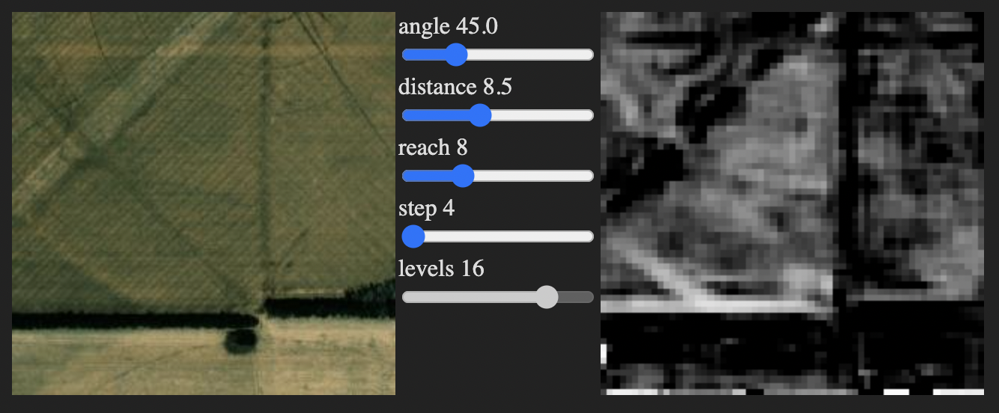

# glcm

Gray-Level Co-Occurrence Matrix image analyzer with WebGL.

A great explanation of what this does:
https://towardsdatascience.com/glcms-a-great-tool-for-your-ml-arsenal-7a59f1e45b65



### Installation

This package requires `twgl.js` to be added via `script` tag to the html:

`<script src="https://twgljs.org/dist/twgl-full.min.js"></script>`

Install with yarn or npm:

`npm install glcm`

### Usage

```javascript
import GLCM from 'glcm'

const gl = document.getElementById('my-canvas').getContext('webgl')
const glcm = new GLCM(gl)

glcm.loadImage(imageSrc).then(async ({ image }) => {
  document.appendChild(image)

  await glcm.init()

  const neighborsBi = glcm.findNeighbors({
    angle: Math.PI / 4,
    distance: 7,
  })

  const mfbi = glcm.buildMatrices(neighborsBi, {
    reach: 8,
    step: 4,
    levels: 16,
  })

  const correlationFbi = glcm.correlation(mfbi)

  glcm.display(correlationFbi)
})
```
